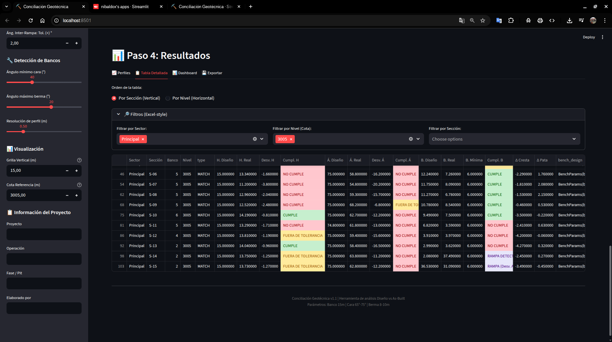
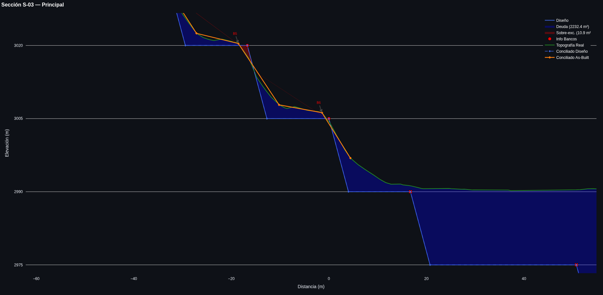
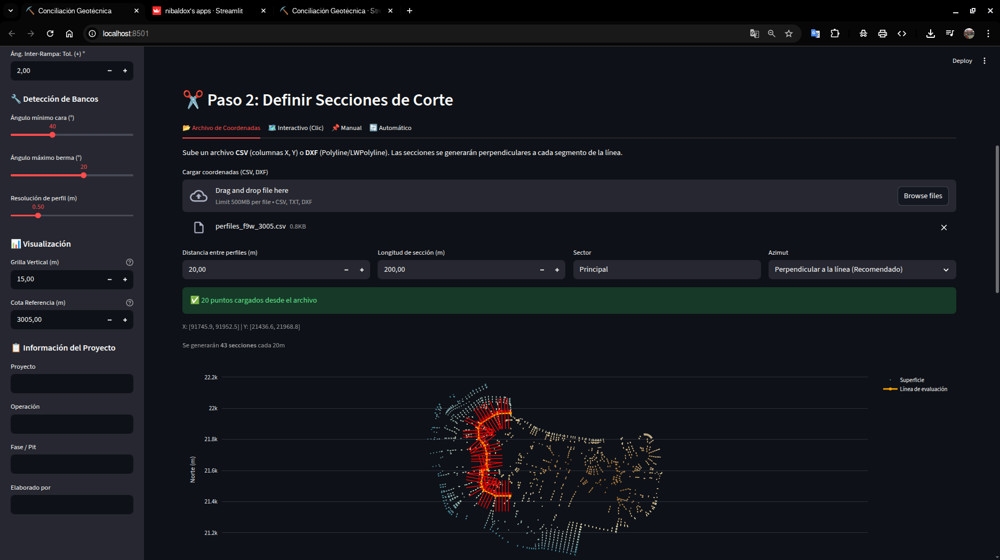
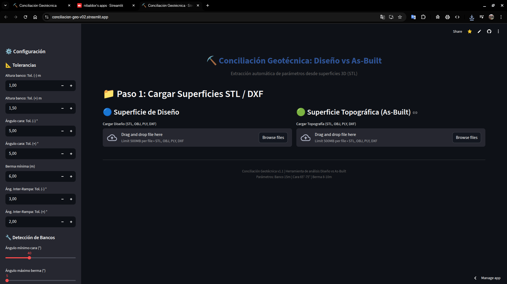

# ⛏️ Conciliación Geotécnica: Diseño vs As-Built


Herramienta avanzada para la conciliación geotécnica en minería a cielo abierto. Permite comparar superficies de diseño (fases) con levantamientos topográficos reales (As-Built) mediante el análisis automático de perfiles transversales.

## 📸 Capturas de Pantalla

| Carga de Datos y Configuración | Análisis de Perfiles |
|:------------------------------:|:--------------------:|
|  |  |
| *Interfaz principal para carga de mallas y configuración de tolerancias* | *Visualización interactiva de perfiles con detección de bancos y bermas* |

| Definición de Secciones | Reportes Detallados |
|:-----------------------:|:-------------------:|
|  |  |
| *Generación automática y manual de secciones de corte* | *Configuración de parámetros de detección (RDP, ángulos)* |

---

## 🚀 Características Principales

Esta aplicación automatiza el flujo de trabajo de conciliación geotécnica, reduciendo el tiempo de análisis de horas a minutos.

### 1. Carga y Procesamiento de Mallas 3D
*   Soporte para formatos **STL, OBJ, PLY, DXF**.
*   Visualización interactiva de nubes de puntos y mallas trianguladas.
*   Alineación automática de sistemas de coordenadas.

### 2. Extracción Automática de Parámetros
El algoritmo inteligente identifica y calcula:
*   **Altura de Banco**: Distancia vertical entre pata y cresta.
*   **Ancho de Berma**: Distancia horizontal entre pata superior y cresta inferior.
*   **Ángulo de Cara**: Inclinación del talud del banco.
*   **Ángulo Inter-rampa**: Pendiente global entre bancos.
*   **Detección de Rampas**: Identificación automática de rampas basada en anchos de berma (15m - 42m).

### 3. Conciliación Diseño vs Real
*   **Matching Inteligente**: Algoritmo húngaro para emparejar bancos de diseño con los reales basado en elevación.
*   **Semáforos de Cumplimiento**: Visualización rápida de desviaciones (Verde/Amarillo/Rojo) según tolerancias configurables.
*   **Cálculo de Volúmenes**: Estimación de áreas de corte (sobre-excavación) y relleno (bancos colgados) por sección.

### 4. Reportabilidad
*   **Tablas Interactivas**: Filtrado por Sector, Nivel y Sección. Ordenamiento flexible.
*   **Exportación a Excel**: Reporte completo compatible con software minero.
*   **Gráficos de Perfil**: Exportación de imágenes de alta resolución de cada sección analizada.

---

## 🛠️ Instalación

1.  **Clonar el repositorio:**
    ```bash
    git clone https://github.com/nibaldox/conciliacion-geo-v02.git
    cd conciliacion-geo-v02
    ```

2.  **Crear un entorno virtual (recomendado):**
    ```bash
    python -m venv venv
    source venv/bin/activate  # En Windows: venv\Scripts\activate
    ```

3.  **Instalar dependencias:**
    ```bash
    pip install -r requirements.txt
    ```

## ▶️ Uso

Ejecuta la aplicación con Streamlit:

```bash
streamlit run app.py
```

La aplicación se abrirá automáticamente en tu navegador predeterminado (usualmente en `http://localhost:8501`).

### Flujo de Trabajo Típico:
1.  **Cargar Superficies**: Sube tus archivos `.stl` de Diseño y Topografía.
2.  **Definir Secciones**: Sube un archivo CSV/DXF con las líneas de corte, o dibújalas interactivamente.
3.  **Procesar**: Haz clic en "Ejecutar Análisis".
4.  **Analizar**: Revisa los perfiles interactivos y la tabla de resultados. Aplica filtros para focalizarte en áreas críticas.
5.  **Exportar**: Descarga el reporte Excel para compartir los hallazgos.

---

## ⚙️ Configuración Avanzada

El archivo `core/param_extractor.py` contiene la lógica principal. Puedes ajustar:
*   **`face_threshold`**: Ángulo mínimo para considerar un segmento como "Cara" (Default: 40°).
*   **`berm_threshold`**: Ángulo máximo para considerar un segmento como "Berma" (Default: 20°).
*   **`simplify_epsilon`**: Tolerancia del algoritmo Ramer-Douglas-Peucker para suavizar perfiles ruidosos.

## 🤝 Contribución

¡Las contribuciones son bienvenidas! Por favor, abre un issue para discutir cambios mayores o envía un Pull Request directo.

## 📄 Licencia

Este proyecto está bajo la Licencia MIT. Consulta el archivo `LICENSE` para más detalles.

---
*Desarrollado con ❤️ para la minería moderna.*
