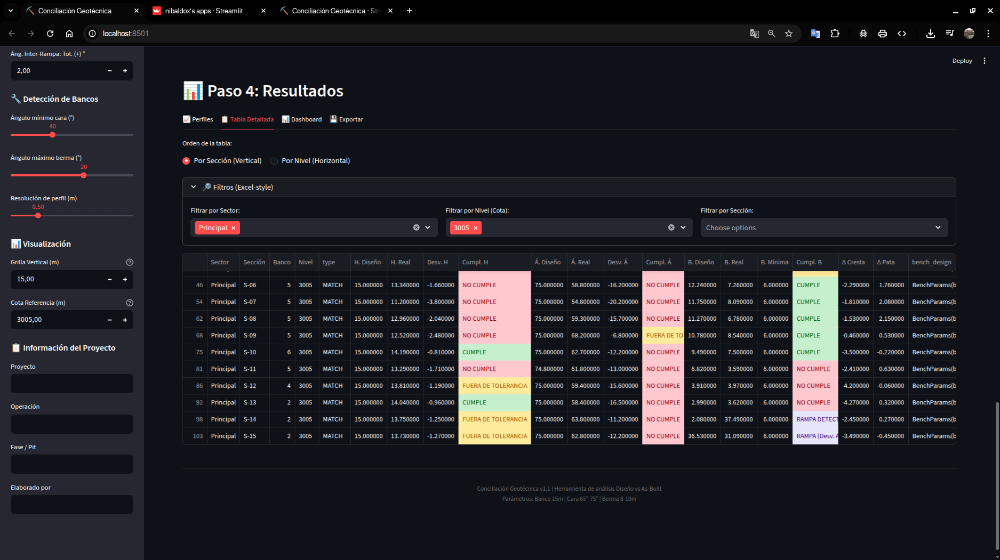
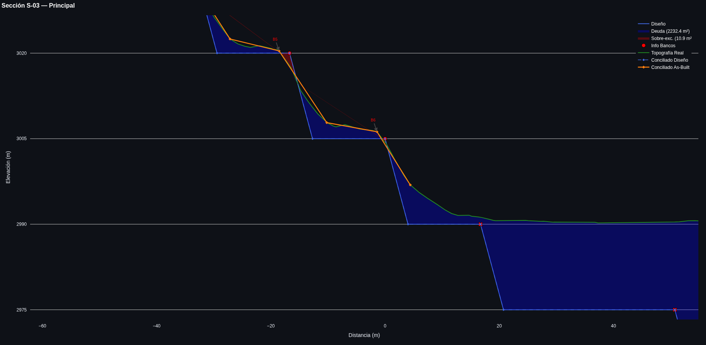
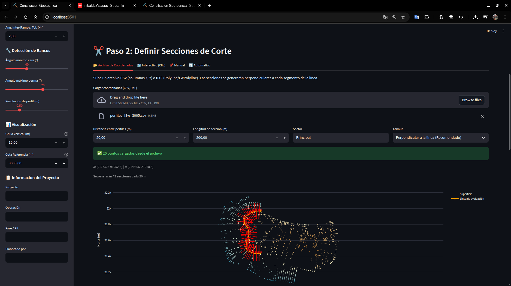
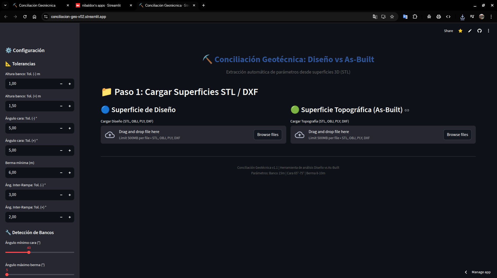

# Conciliación Geotécnica — Diseño vs As-Built

[](https://python.org)
[](https://fastapi.tiangolo.com)
[](https://react.dev)
[](https://www.typescriptlang.org)
[](https://web.dev/progressive-web-apps/)
[](LICENSE)
[](tests/)
[-brightgreen)](tests/)

> **Open-source geotechnical reconciliation for open-pit mining.** Compare
> 3D design surfaces vs as-built topography, generate cross-sections,
> evaluate compliance against configurable tolerances, integrate
> Drill & Blast data with quantitative stability analysis (FS planar,
> health score, alert system), export professional Excel/Word/DXF
> reports. All in your browser.
>
> *Conciliación geotécnica open-source para minería a cielo abierto.
> Compara superficies 3D de diseño vs topografía real, genera
> secciones, evalúa cumplimiento contra tolerancias, e integra
> tronadura con análisis cuantitativo de estabilidad.*

[Live demo](https://nibaldox.github.io/conciliacion-geo-v02/) ·
[Architecture](ARCHITECTURE.md) ·
[Deploy guide](web/DEPLOY.md) ·
[Contributing](CONTRIBUTING.md)

---

## ⚡ Try it now — no signup

The hosted demo is **free, public, and requires no account**:

1. Open the [live site](https://nibaldox.github.io/conciliacion-geo-v02/)
2. Click **🎮 Try with sample data**
3. Browse the dashboard, 3D viewer, and exported reports
4. (Optional) Click **Empezar** to upload your own `.stl`

The frontend is hosted on GitHub Pages (free). The backend runs on
Render.com (free tier) only when you upload your own data.

---

## ✨ Features

### Core reconciliation
- **Multi-format mesh support** — STL, OBJ, PLY, DXF
- **Auto-section generation** — by start/end line, by polyline file, or click-on-map
- **3D native interactions** — select and edit cross-section paths directly on the 3D terrain viewer
- **Asymmetric profiles & rich graphs** — configure independent up/down profile lengths and view live reconciliation data (Delta Crest, Delta Toe) directly on interactive 2D profile graphs
- **RDP + Hungarian matching** — robust bench / berm / face detection with no double-counting
- **Compliance dashboard** — CUMPLE / FUERA / NO CUMPLE per sector, parameter, bench
- **Excel / Word / DXF exports** — formatted reports ready for engineering review

### Drill & Blast integration
- **Powder Factor volumétrico** (kg/m³) con k-NN fallback si no hay burden/espaciamiento
- **6 ratios derivados** — stemming/burden, subdrilling/burden, S/B, kg/m, coupling, collar deviation
- **Catálogo ENAEX** — Pirex-930/920/950/970, Enaline, parser de diámetro `"10 5/8"` → 270 mm
- **Modelo cuantitativo PF→daño** — β₁, p-valor, R², IC 95%, confianza (HIGH/MEDIUM/LOW)
- **Motor de recomendaciones** — ΔPF objetivo con factibilidad y restricciones operacionales
- **Heatmap 2D IDW** — densidad de energía integrada en Z, con sliders de resolución y σ
- **Tendencia temporal** de PF/daño y comparativa pre/post campaña

### Geotechnical stability
- **Detección de precursores de falla** — overhangs, rock bridges, catch bench effectiveness, wedge (diedros agudos), toppling, consistencia de ángulos, anisotropía de caras
- **Factor de seguridad planar** — Hoek-Bray 1981 con cohesión, fricción, presión de poros
- **RMR/GSI lookup** desde CSV geomecánico con estimación Hoek-Brown de (c, φ)
- **Health score semáforo** — 0-100 con categorías GREEN/YELLOW/ORANGE/RED
- **Alert system categorizado** — OVERHANG_CRITICAL, CATCH_BENCH_INADEQUATE, TOPPLING_RISK, WEDGE_RISK, ANGLE_INCONSISTENT

### Platform
- **🌐 Bilingual UI** — Spanish (default) + English, switchable from the header
- **📱 PWA** — installable, works offline, sub-330 KB initial bundle
- **🎮 Demo mode** — pre-computed synthetic pit, 4 benches, 5 sections, 40 compliance rows, no upload needed
- **🔓 Open source, MIT** — your data stays in your session, no hidden telemetry

---

## 🚀 Two ways to run it

The project ships **two complete user interfaces** that share the
same `core/` domain logic:

### 1. Web app (recommended for sharing) — `web/`

Modern React 19 + FastAPI architecture, deployed for free on
GitHub Pages + Render.com. See [web/DEPLOY.md](web/DEPLOY.md)
for the full guide.

```bash
# Backend
pip install -e .
uvicorn api.main:app --reload --port 8000

# Frontend (separate terminal)
cd web && npm install && npm run dev    # → http://localhost:5173
```

> **Troubleshooting (Linux):** Si `npm run dev` falla con
> `Cannot find module '@rollup/rollup-linux-x64-gnu'`, ejecuta
> `npm install @rollup/rollup-linux-x64-gnu@^4.34.0 --save-dev`.
> Rollup es nativo, necesita el binario específico para tu plataforma.
> Ver `package.json#optionalDependencies` para todas las plataformas
> soportadas.

```

### 2. Streamlit (the maintainer uses this daily) — `app.py`

Single-file Streamlit app, no separate backend. **Not touched by
recent v2 work** — the maintainer uses it for real work and the
contributing guide explicitly forbids changes here.

```bash
pip install -r requirements.txt
streamlit run app.py                        # → http://localhost:8501
```

Both interfaces call the same `core/` library (mesh cutting,
parameter extraction, comparison, export) so results are
identical.

---

## 📸 Screenshots

The legacy Streamlit UI has screenshots in [`printscr/`](printscr/)
that show the four-step workflow. The new React webapp is
visually richer (3D Cesium viewer, drag-to-edit bench editor,
compliance dashboard with traffic-light colour coding); we're
in the process of capturing fresh screenshots — PRs welcome.

| Dashboard overview (Streamlit, legacy) | Profile analysis (Streamlit, legacy) |
|:--:|:--:|
|  |  |

| Section definition (Streamlit, legacy) | Parameter settings (Streamlit, legacy) |
|:--:|:--:|
|  |  |

---

## 🏗️ Architecture

```
                            ┌────────────────────────────┐
                            │   GitHub Pages (static)    │
                            │   nibaldox.github.io/...   │
                            │   • React 19 + Vite 6      │
                            │   • CesiumJS 1.140 (lazy)  │
                            │   • Plotly 2.35 (lazy)     │
                            │   • PWA + Workbox SW       │
                            │   • i18n ES/EN             │
                            │   • 330 KB initial bundle  │
                            └─────────┬──────────────────┘
                                      │ HTTPS + CORS allowlist
                                      ▼
                            ┌────────────────────────────┐
                            │   Render.com (Docker)      │
                            │   FastAPI + uvicorn        │
                            │   • /api/v1/* routers      │
                            │   • SQLite sessions        │
                            │   • Health probes          │
                            │   • Slowapi rate limit     │
                            └─────────┬──────────────────┘
                                      │
                                      ▼
                            ┌────────────────────────────┐
                            │   core/  (shared domain)   │
                            │   • mesh_handler           │
                            │   • section_cutter         │
                            │   • param_extractor        │
                            │   • excel_writer           │
                            │   • report_generator       │
                            │   • blast_correlation      │
                            └────────────────────────────┘
```

For the full breakdown see [ARCHITECTURE.md](ARCHITECTURE.md).
For deploy step-by-step see [web/DEPLOY.md](web/DEPLOY.md).

---

## 🧪 Running tests

```bash
pytest tests/ -v                             # 633 backend tests, 95% coverage on core/ai_v2/
python test_pipeline.py                      # end-to-end pipeline
cd web && npm run build                      # TypeScript + Vite build
cd web && npm run lint                       # ESLint

# Coverage breakdown (current snapshot, June 2026)
python -m coverage run -m pytest tests/ --tb=short
python -m coverage report --include="core/*.py"
```

Coverage highlights (all core/ files ≥ 87%):

| File | Stmts | Cover |
|------|-------|-------|
| `core/alert_system.py` | 45 | 100% |
| `core/column_utils.py` | 11 | 100% |
| `core/compliance_status.py` | 18 | 100% |
| `core/geology.py` | 73 | 100% |
| `core/param_extractor.py` (shim) | 6 | 100% |
| `core/profile_extract.py` | 175 | 98% |
| `core/excel_writer.py` | 318 | 98% |
| `core/calculo_tronadura.py` | 143 | 98% |
| `core/geom_utils.py` | 48 | 98% |
| `core/report_generator.py` | 402 | 98% |
| `core/section_cutter.py` | 117 | 97% |
| `core/blast_metrics.py` | 203 | 97% |
| `core/config.py` | 126 | 97% |
| `core/explosive_properties.py` | 56 | 96% |
| `core/profile_compliance.py` | 118 | 96% |
| `core/blast_correlation.py` | 190 | 95% |
| `core/profile_simplify.py` | 65 | 94% |
| `core/blast_advisor.py` | 172 | 91% |
| `core/blast_model.py` | 137 | 88% |
| `core/mesh_handler.py` | 103 | 87% |

The frontend has no unit tests yet — Playwright is installed but
not wired into CI. PRs adding Vitest + RTL would be very welcome.

---

## 🛠️ Project structure

```
core/             ← domain logic, imported by BOTH interfaces
  mesh_handler.py                (load_mesh, decimate_mesh, mesh_to_plotly, DXF loader)
  section_cutter.py              (cut_mesh_with_section, generate_perpendicular_sections)
  param_extractor.py             (compat shim: re-exports from the 4 modules below)
  profile_simplify.py            (RDP + toe projection)
  profile_extract.py             (ReconciledPoint/Profile, BenchParams, ExtractionResult)
  bench_classify.py              (berm width + leading/trailing berm)
  bench_hazards.py               (overhang, rock bridge, wedge, toppling, anisotropy)
  profile_compliance.py          (compare_design_vs_asbuilt, build_reconciled_profile)
  blast_correlation.py           (Drill & Blast ↔ geotech correlation, signed deviations)
  blast_metrics.py               (PF, stemming ratio, kg/m, altura de carga, Kuznetsov X₅₀)
  blast_model.py                 (PF→damage regression, pasadura↔toe correlation, IDW profile)
  blast_advisor.py               (recommend_pf_adjustment, validate_recommendation)
  stability_analysis.py          (FS planar Hoek-Bray, health score 0-100)
  alert_system.py                (categorized alerts: OVERHANG_CRITICAL, TOPPLING_RISK, etc.)
  geology.py                     (RMR/GSI lookup + Hoek-Brown strength estimation)
  explosive_properties.py        (ENAEX catalogue: Pirex/Enaline + diameter parser)
  column_utils.py                (shared column candidate lists for CSV ingestion)
  compliance_status.py           (single source of truth: STATUS_CUMPLE, STATUS_FUERA, ...)
  excel_writer.py
  report_generator.py            (Word report + PNG ZIP)
  geom_utils.py
  ai_v2/                        (LLM agent v2 — provider-agnostic, async, 95% coverage)
  breaklines.py                  (breakline detection for section generation)
  config.py                      (frozen dataclasses with all defaults: tolerances, explosives)

api/              ← FastAPI backend (modular, /api/v1/*)
  routers/        (meshes, sections, process, export, settings)
  middleware*.py  (request id, structured log, rate limit)
  main.py         (app factory + lifespan + health probes)

web/              ← React 19 + Vite 6 + CesiumJS frontend
  src/components/  (wizard steps, demo, landing, ui primitives)
  src/locales/     (es.json, en.json)
  src/api/         (axios client, TanStack Query hooks)
  public/demo/     (synthetic STLs + precomputed.json for demo mode)
  DEPLOY.md        (step-by-step deploy guide)

app.py / ui/      ← LEGACY Streamlit UI (do not modify)
docs/             ← additional documentation
  BLAST_DATA_AUDIT.md            (31 mejoras para el módulo de tronadura)
  SLOPE_STABILITY_AUDIT.md       (31 mejoras geotécnicas)
  BLAST_ADVISOR.md               (API reference del motor de recomendaciones)
  CLEAN_CODE_AUDIT.md            (auditoría clean code + clean architecture)
scripts/          ← one-off generators (demo data, etc.)
tests/            ← pytest suite for core/ + api/ (633 tests)
ARCHITECTURE.md   ← architecture overview
AGENTS.md         ← entry point for AI agents
CONTRIBUTING.md   ← contribution guide
CODE_OF_CONDUCT.md
LICENSE           ← MIT
```

---

## 🌐 Internationalization

UI strings live in `web/src/locales/{es,en}.json`. To add a new
key:

1. Add it to BOTH `es.json` and `en.json` under the right namespace
   (`nav`, `common`, `demo`, `step1`..`step4`, `compliance`,
   `tooltip`, `shortcuts`, `landing`)
2. Use it in the component: `const { t } = useTranslation(); t('key')`
3. For counts, use ICU plurals: `t('common.n_sections', { count: n })`
   with `_one` / `_other` keys

The language is persisted in `localStorage` and the `<html lang>`
attribute is kept in sync (for screen readers).

---

## 🔭 Observability (opt-in)

All telemetry is **off by default** — the site ships zero
observability unless you opt in. See [web/DEPLOY.md](web/DEPLOY.md)
for setup.

| Tool | What | Env var |
|---|---|---|
| Sentry (frontend) | JS errors, perf, replays on error | `VITE_SENTRY_DSN` |
| Sentry (backend) | Python exceptions, slow requests | `SENTRY_DSN` |
| Plausible / CF / etc. | Privacy-friendly page views | `VITE_ANALYTICS_URL` |
| UptimeRobot | Is `/api/v1/health` 200 every 5 min? | (no env var — set up at uptimerobot.com) |

Mesh file names never leave your server (`send_default_pii=False`
on the backend; query strings are stripped before Sentry reports
on the frontend).

---

## 🤝 Contributing

We love PRs! See [CONTRIBUTING.md](CONTRIBUTING.md) for the full
guide. Highlights:

- **Streamlit (`app.py`, `ui/`) is OFF-LIMITS** — the
  maintainer uses it daily for real work. New work goes in
  `web/` and `api/`, and must be **additive**.
- **`core/` is shared domain logic** — both interfaces depend on
  it. Changes to `core/` are welcome but should preserve the
  public API of the legacy-stable modules in `core/__init__.py`.
- **Both locales, always** — when adding a UI string, add it to
  BOTH `es.json` and `en.json`.
- **Conventional commits** (`feat:`, `fix:`, `refactor:`, `test:`,
  `docs:`, `chore:`). No `Co-Authored-By:`. No AI attribution.
- **The maintainer triages fast** if your PR description is clear
  and you've filled in the PR template.

Our [Code of Conduct](CODE_OF_CONDUCT.md) is Contributor Covenant
2.1.

## 📐 Using the Drill & Blast pipeline programmatically

The blast analysis can be used outside Streamlit (e.g. from a
Jupyter notebook or a batch script):

```python
import pandas as pd
from core.calculo_tronadura import procesar_pozos
from core.blast_metrics import enrich_blast_dataframe
from core.blast_model import fit_powder_factor_damage_model
from core.blast_advisor import recommend_pf_adjustment, format_recommendation_text

# 1. Load your blast hole CSV/XLSX (ENAEX, Datamine, etc.)
df = pd.read_excel("enaex_pozos_tronadura_2026.xlsx", sheet_name="Data")

# 2. Process holes: project collar→toe, derive coordinates
df_clean, *_ = procesar_pozos(df)

# 3. Enrich with PF, stemming ratio, kg/m, etc.
df_enriched = enrich_blast_dataframe(df_clean)

# 4. Fit damage model from observed deviations
model = fit_powder_factor_damage_model(
    pf=df_enriched["pf_vol_avg"],
    damage=df_enriched["delta_crest"],
)

# 5. Get actionable recommendation
rec = recommend_pf_adjustment(model, current_pf=0.55, target_overbreak_m=0.5)
print(format_recommendation_text(rec, section_name="NORTE_4200"))
# → "Reducir PF de 0.55 a 0.38 kg/m³ (-31%) proyecta acotar sobre-excavación..."
```

For stability analysis (requires RMR CSV or default parameters):

```python
from core.param_extractor import extract_parameters
from core.stability_analysis import (
    compute_section_health_score,
    compute_planar_factor_of_safety,
    aggregate_section_alerts,
)

# Run reconciliation as usual
result = extract_parameters(distances, elevations, section_name="SEC_01")

# Health score 0-100 with traffic-light category
health = compute_section_health_score("SEC_01", result.benches)
print(f"{health.health_category}: {health.health_score:.0f}/100")
print(health.recommended_action)

# Get all alerts with categorized severity
report = aggregate_section_alerts("SEC_01", result.benches)
for alert in report.alerts:
    print(f"[{alert.level}] {alert.message} → {alert.action}")
```

---

## 📜 License

[MIT](LICENSE) — do what you want, just keep the copyright
notice. If you build something cool on top of this, we'd love
to hear about it.

---

## 🙋 Maintainer

- **Nibaldo Aviles** ([@nibaldox](https://github.com/nibaldox)) —
  geotechnical engineer who needed this for real projects and
  decided to share.

## 🌟 Star history

If this saved you a few days of work, a star on GitHub helps
others find it. ⭐
