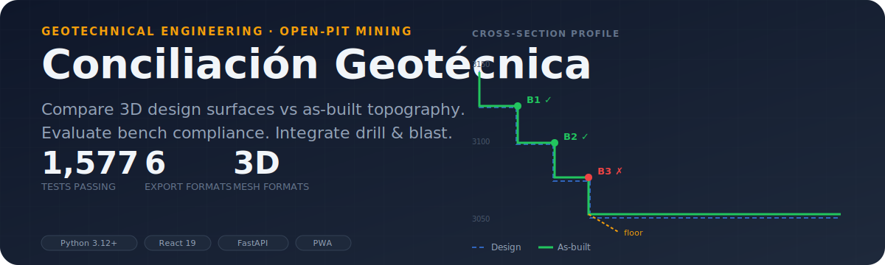
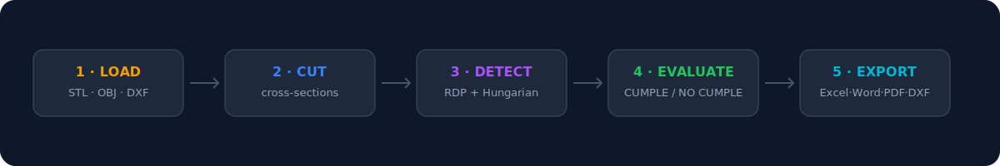
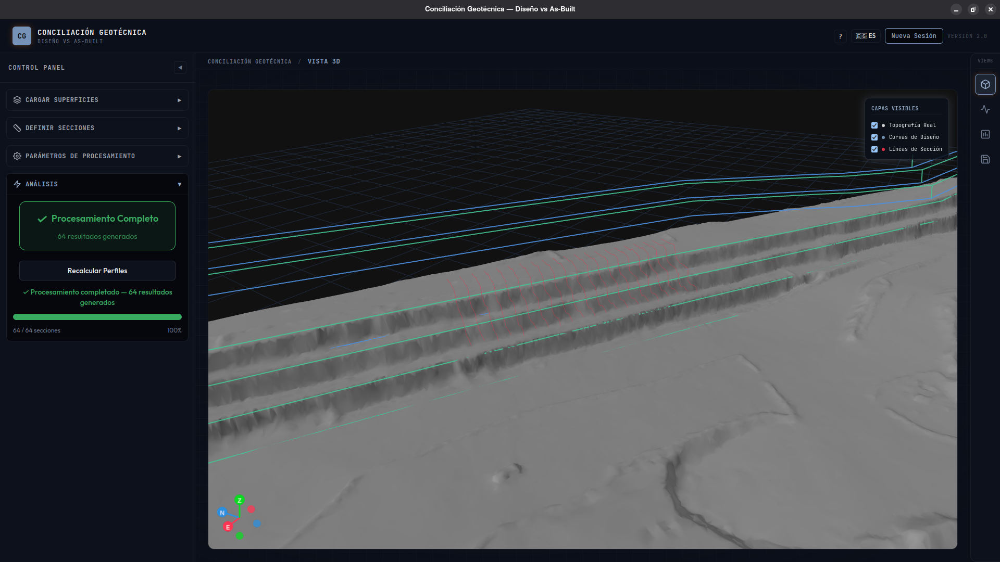
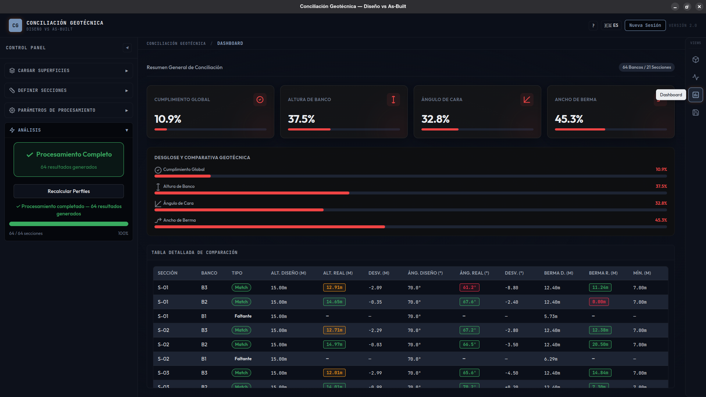
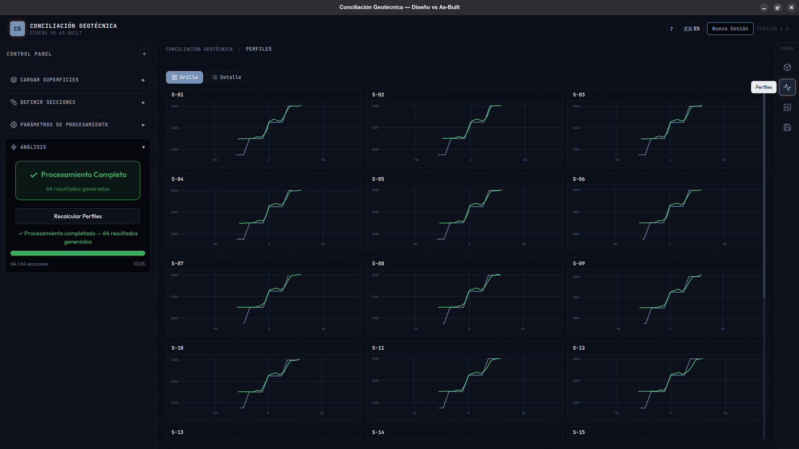

<p align="center">
  
</p>

<p align="center">
  <a href="https://github.com/nibaldox/conciliacion-geo-v02/actions/workflows/ci.yml"></a>
  <a href="https://github.com/nibaldox/conciliacion-geo-v02/actions/workflows/deploy-frontend.yml"></a>
  <a href="LICENSE"></a>
  <a href="https://nibaldox.github.io/conciliacion-geo-v02/"></a>
</p>

<p align="center">
  <a href="https://nibaldox.github.io/conciliacion-geo-v02/">🌐 Live Demo</a> ·
  <a href="ARCHITECTURE.md">Architecture</a> ·
  <a href="CONTRIBUTING.md">Contributing</a>
</p>

---

> Open-source geotechnical reconciliation for open-pit mining. Compare
> 3D design surfaces vs as-built topography, generate cross-sections,
> evaluate bench compliance against configurable tolerances, integrate
> drill &amp; blast data, and export professional reports — all in your browser.

---

<p align="center">
  
</p>

## Pipeline

<p align="center">
  
</p>

## Real outputs

The tool is used on real mining projects. These are actual screenshots from the webapp:

| 3D profiles viewer | Compliance dashboard |
|:---:|:---:|
|  |  |

| Profile grid | |
|:---:|:---:|
|  | |

## Features

**Core reconciliation**
- Multi-format mesh support — STL, OBJ, PLY, DXF
- Auto-section generation — by line, by polyline, or click-on-3D-map
- RDP + Hungarian matching — robust bench/berm/face detection with no double-counting
- Reconciled profile — idealized geometry with per-bench floor extension and angular transitions
- Binary compliance — **CUMPLE / NO CUMPLE** with weighted score (berm 60 + angle 20 + height 20; pass ≥ 70)

**Drill &amp; Blast integration**
- Powder Factor dual — volumetric (kg/m³) and massic (g/ton) with real vertical height
- Blast-hole traceability — `attribute_failure_to_holes()` links failing benches to specific drill holes
- Causal engine — `explain_non_compliance()` explains *why* a bench failed (PF excess, stemming deficit, etc.)
- PF→damage regression model with confidence intervals
- Blast advisor with operational recommendation engine

**Geotechnical stability**
- Planar factor of safety (Hoek-Bray 1981)
- RMR/GSI lookup from CSV with Hoek-Brown strength estimation
- Health score 0–100 with traffic-light categories
- Categorized alert system (overhang, catch bench, toppling, wedge risk)

**Reports** — 6 formats, all binary compliance
- **Excel** — bench-by-bench parameters + KPIs
- **Word** — executive report with pie charts + compliance plan view
- **PDF** — unified executive PDF (reportlab)
- **DXF** — 3D polylines for CAD import
- **PNG ZIP** — section images
- **AI** — LLM-powered narrative report with unified DataFrame context

---

<p align="center">
  
</p>

## Try it now — no signup

The hosted demo is **free, public, and requires no account**:

1. Open the [**live site**](https://nibaldox.github.io/conciliacion-geo-v02/)
2. Click **"Try with sample data"**
3. Browse the dashboard, 3D viewer, profile analysis, and exported reports

Frontend is on GitHub Pages (free). Backend runs on Render.com free tier (cold start ~30s).

## Run locally

**Prerequisites:** Python 3.10+, Node.js 20+, `libspatialindex-dev` (Linux: `sudo apt install libspatialindex-dev`)

```bash
git clone https://github.com/nibaldox/conciliacion-geo-v02.git
cd conciliacion-geo-v02

# Backend (terminal 1)
pip install -e .
uvicorn api.main:app --reload --port 8000

# Frontend (terminal 2)
cd web && npm install && npm run dev   # → http://localhost:5173
```

Or run both together: `bash dev.sh`

<details>
<summary><b>Streamlit (alternative UI)</b></summary>

```bash
pip install -r requirements.txt
streamlit run app.py   # → http://localhost:8501
```

The maintainer uses Streamlit daily for real projects. It's an **alpha preview** where new
features land first before being ported to React. Bug fixes welcome; refactors need approval.

</details>

<details>
<summary><b>Troubleshooting: Rollup native binary (Linux)</b></summary>

If `npm run dev` fails with `Cannot find module '@rollup/rollup-linux-x64-gnu'`, run:

```bash
npm install @rollup/rollup-linux-x64-gnu@^4.34.0 --save-dev
```

Rollup ships per-platform native binaries. See `package.json#optionalDependencies`.

</details>

---

## Architecture

```
  GitHub Pages (static)              Render.com (Docker)
  ┌──────────────────┐              ┌──────────────────┐
  │ React 19 + Vite  │   /api/v1    │ FastAPI + uvicorn│
  │ CesiumJS (lazy)  │ ◄──────────► │ SQLite sessions  │
  │ Plotly (lazy)    │   HTTPS+CORS │ core/ domain     │
  │ PWA + i18n ES/EN │              └────────┬─────────┘
  └──────────────────┘                       │
                                   ┌─────────▼──────────┐
                                   │ core/ (shared)     │
                                   │ mesh_handler       │
                                   │ section_cutter     │
                                   │ profile_extract    │
                                   │ profile_compliance │
                                   │ blast_correlation  │
                                   │ blast_advisor      │
                                   │ report_generator   │
                                   └────────────────────┘
```

Both the React webapp and the Streamlit UI call the same `core/` domain logic, so results are identical. Full breakdown: [ARCHITECTURE.md](ARCHITECTURE.md).

---

## Testing

```bash
pytest tests/ -v --tb=short --ignore=tests/test_openblast.py   # 1,233 backend tests
python test_pipeline.py                                          # end-to-end synthetic
cd web && npm run test                                           # 344 frontend tests (vitest)
cd web && npm run build                                          # TypeScript + Vite build
```

| Suite | Count | Status |
|---|---|---|
| Backend (pytest) | 1,233 | ✅ passing (8 skipped) |
| Frontend (vitest) | 344 | ✅ passing |
| `npm run build` | — | ✅ 0 errors |
| **Total** | **1,577** | ✅ |

---

## Project structure

```
core/          ← domain logic (shared by both UIs)
api/           ← FastAPI backend (/api/v1/*)
web/           ← React 19 + Vite 6 + CesiumJS frontend
app.py + ui/   ← Streamlit alpha preview (maintainer's daily driver)
electron/      ← Portable AppImage bundle
tests/         ← pytest + vitest
```

---

## Contributing

PRs welcome! See [CONTRIBUTING.md](CONTRIBUTING.md). Highlights:

- **`core/` is shared** — both interfaces depend on it; preserve the public API
- **Streamlit (`app.py`, `ui/`) is protected** — bug fixes welcome, refactors need approval
- **Both locales always** — add UI strings to BOTH `es.json` and `en.json`
- **Conventional commits** — `feat:`, `fix:`, `refactor:`, `test:`, `docs:`

## License

[MIT](LICENSE) — do what you want, just keep the copyright notice.

## Maintainer

**Nibaldo Aviles** ([@nibaldox](https://github.com/nibaldox)) — geotechnical engineer who built this for real mining projects and decided to share.
