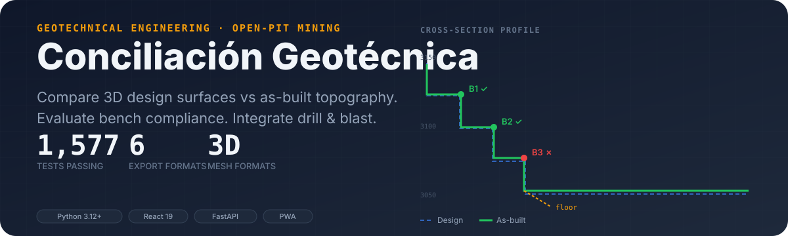
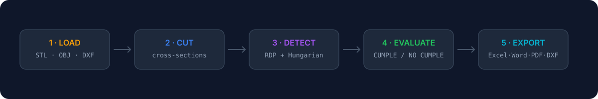
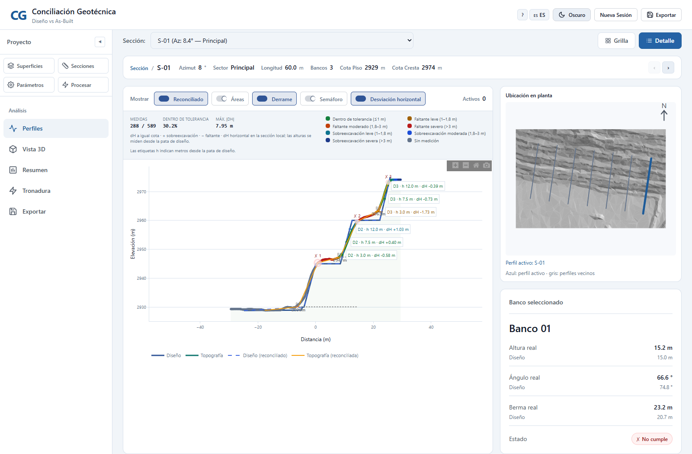
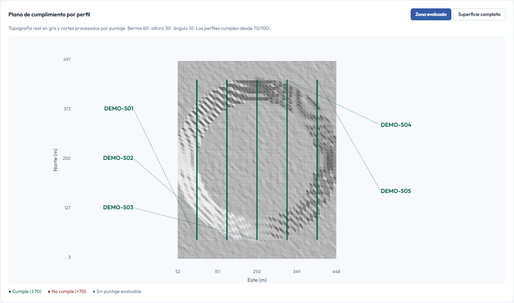
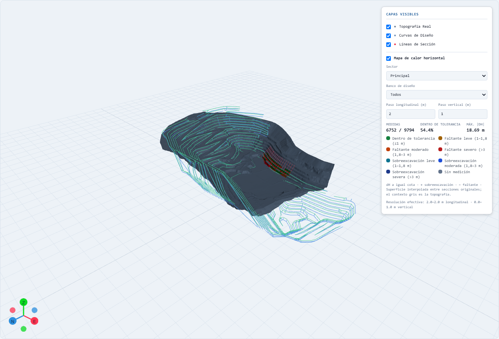
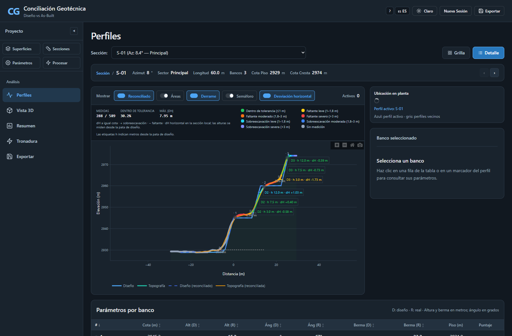

<p align="center">
  
</p>

<p align="center">
  <a href="https://github.com/nibaldox/conciliacion-geo-v02/actions/workflows/ci.yml"></a>
  <a href="https://github.com/nibaldox/conciliacion-geo-v02/actions/workflows/deploy-frontend.yml"></a>
  <a href="LICENSE"></a>
  <a href="https://nibaldox.github.io/conciliacion-geo-v02/"></a>
</p>

<p align="center">
  <a href="https://nibaldox.github.io/conciliacion-geo-v02/">Demo web</a> ·
  <a href="ARCHITECTURE.md">Arquitectura</a> ·
  <a href="CONTRIBUTING.md">Contribuir</a> ·
  <a href="docs/HANDOFF.md">Continuidad para agentes</a>
</p>

# Conciliación Geotécnica v02

Herramienta de código abierto para comparar el diseño de taludes con su construcción real en minería a cielo abierto. Importa superficies 3D, genera secciones, extrae parámetros de bancos, evalúa tolerancias e integra datos de perforación y tronadura. Permite revisar los resultados en planta, perfiles y vista 3D, y exportar informes.

**Documentación revisada el 7 de octubre de 2026** (America/Santiago). Incluye los cambios locales registrados hasta el 4 de octubre, consolidados en Git local por solicitud del mantenedor el 7 de octubre. Consultar `git log -1` para identificar el commit: su presencia local no demuestra que esté publicado en la demo o incluido en una versión portable. El foco actual es finalizar la versión web; el siguiente empaquetado portable está pospuesto.

## Contenido

- [Funciones y actualizaciones](#funciones-y-actualizaciones)
- [Cómo se calcula el cumplimiento](#cómo-se-calcula-el-cumplimiento)
- [Flujo de trabajo](#flujo-de-trabajo)
- [Instalación y ejecución local](#instalación-y-ejecución-local)
- [Arquitectura y API](#arquitectura-y-api)
- [Configuración](#configuración)
- [Pruebas y estado de validación](#pruebas-y-estado-de-validación)
- [Despliegue y portable](#despliegue-y-portable)
- [Limitaciones y solución de problemas](#limitaciones-y-solución-de-problemas)
- [Documentación y continuidad](#documentación-y-continuidad)

## Funciones y actualizaciones

### Superficies y secciones

- Carga de STL, OBJ, PLY y DXF para diseño y topografía; se admiten superficies abiertas.
- Importación DXF con inspección de capas, unidades, extensión XYZ y advertencias antes de confirmar. Admite `3DFACE`, POLYFACE, `MESH` plano, bloques transformados/anidados y `MINSERT`. Las opciones se conservan al reconstruir la malla desde SQLite. [Guía DXF](docs/DXF_SUPERFICIES.md).
- Límite del cargador STL ampliado a **250 MiB** (262.144.000 bytes). El límite HTTP de la API es independiente y, por defecto, **500 MiB** por petición.
- Definición de secciones desde archivos CSV/TXT/DXF, líneas y polilíneas, o selección en la vista 3D; edición de coordenadas, azimut, longitudes y sector.
- Extracción de caras, alturas, bermas, rampas y puntos de cresta/pata; comparación de bancos con asignación global y restricciones geométricas.

### Perfiles y resumen

- Temas claro/oscuro persistentes, navegación lateral compacta y distribución adaptable a escritorio y móvil.
- Grilla y detalle de perfiles con **escala horizontal = vertical (1:1)**, zoom, restablecimiento de ejes y descarga PNG.
- Inspector de banco vinculado a la tabla y a los marcadores; selección por clic/teclado y popup con valores reales, planificados y diferencias de cresta/pata.
- Identidad explícita del banco topográfico (`bench_num_topo`), sin asociar un banco ausente a otro por coincidencia de número.
- Miniatura de ubicación con topografía, perfil activo, vecinos y Norte; consulta ROI para el contexto topográfico del detalle.
- Filtro múltiple por banco y plano de cumplimiento con encuadre de la zona evaluada o de la superficie completa. Los puntajes de los informes se recalculan con los filtros aplicados.
- Perfiles conciliados orientados de cresta a pata y cierre de piso tomado del perfil fuente.

### Desviación horizontal y diagnóstico geométrico

- Medición de **dH a igual cota**, con muestras al 20%, 50% y 80% de la altura física del banco de diseño, desde su pata. Positivo: sobreexcavación; negativo: subexcavación/faltante.
- Mapa horizontal 3D por sector y banco, con pasos longitudinal y vertical configurables (inicialmente 2 m y 1 m). El grupo sin nombre de sector también puede evaluarse.
- Cálculo sobre cortes de las mallas originales. La superficie entre cortes compatibles se interpola; no se extrapola fuera de las secciones configuradas.
- Cruces ausentes o ambiguos conservan su estado y un valor nulo; no se colorean como mediciones válidas. Las rampas con cobertura y cruce único pueden medirse manteniendo su clasificación.
- Diagnósticos por superficie para cortes vacíos, desconectados o ambiguos. La conectividad se analiza después de recortar a la longitud de la sección.
- Recuperación de retrocesos locales hasta el menor valor entre la resolución del perfil y el límite de 0,1 m, mediante un tramo vertical que conserva las cotas y emite `minor_profile_reversal_normalized`. Los pliegues mayores y las ramas siguen rechazándose.
- Compatibilidad con orígenes de sección XY o XYZ finitos; el plano vertical usa XY. Caché de perfiles vinculada a ambas mallas e invalidada al reprocesar; errores de carga con reintento y conservación del gráfico cacheado.

### Perforación, tronadura y estabilidad

- Carga y mapeo de datos de pozos, con confirmación de unidades, convenciones angulares, semántica de cota y altura de banco cuando corresponde.
- Powder Factor volumétrico (kg/m³), másico (g/ton), relación de taco y carga lineal (kg/m), con trazabilidad de fuentes y advertencias.
- Correlación entre pozos y secciones, atribución de fallas y explicaciones mediante reglas; regresión PF–daño y recomendaciones con incertidumbre y condiciones de aplicabilidad. [Motor de recomendaciones](docs/BLAST_ADVISOR.md).
- Motor determinista de energía 3D, cortes en planta/sección, perfil y exportaciones XLSX/NPZ/JSON. Sus contratos y limitaciones científicas se documentan en las [auditorías de Fase 2](INFORME_AUDITORIA_FINAL_FASE_2.md).
- Análisis de estabilidad planar, estimaciones de resistencia con RMR/GSI y alertas geotécnicas. [Auditoría de estabilidad](docs/SLOPE_STABILITY_AUDIT.md).

### Informes y rendimiento web

| Salida | Contenido |
|---|---|
| Excel | Parámetros por banco, comparaciones, indicadores y datos de tronadura |
| Word | Informe ejecutivo, gráficos y plano de cumplimiento |
| PDF | Informe ejecutivo con filtros y plano de cumplimiento |
| DXF | Polilíneas 3D para revisión en CAD |
| ZIP de PNG | Imágenes de secciones |
| Informe IA | Narrativa con contexto de resultados; streaming, copiar y descargar |

El agente de informes está en `core/ai_v2/`: incluye proveedores locales y remotos, configuración y caché. La interfaz renderiza Markdown GFM, tablas y listas a ancho disponible; no ejecuta HTML crudo del informe. [Migración IA v2](docs/MIGRATION_AI_V2.md).

Los gráficos comparten el bundle cartesiano de Plotly y se cargan bajo demanda. La medición local del 30 de septiembre registró una reducción de 68,5% en JavaScript y 66,1% en gzip respecto del bundle anterior; son tamaños de compilación, no tiempos de renderizado. [Detalle de mejoras](docs/MEJORAS_LOCAL.md).

## Cómo se calcula el cumplimiento

Se distinguen los estados por parámetro del puntaje agregado:

| Evaluación | Regla actual |
|---|---|
| Altura y ángulo | `CUMPLE` dentro de la tolerancia; `FUERA DE TOLERANCIA` hasta 1,5× el límite; `NO CUMPLE` sobre ese valor. Las tolerancias negativas/positivas pueden ser distintas. |
| Berma | `CUMPLE` si el ancho real alcanza el mínimo configurado; en caso contrario, `NO CUMPLE`. |
| Puntaje por banco emparejado | Berma **60**, altura **30**, ángulo **10**. Un parámetro aporta sus puntos solo si cumple su tolerancia. |
| Puntaje por perfil | Promedio de sus bancos `MATCH`; cumple desde **70/100**. |
| Puntaje global | Promedio de los perfiles evaluables, cada uno con igual peso. Sin bancos emparejados evaluables, el resumen indica `SIN DATOS`. |

`MISSING`, `EXTRA` y estados desconocidos permanecen explícitos; no se convierten en un emparejamiento ni se incorporan como bancos válidos al promedio. Un perfil puede tener puntaje y también bancos sin pareja: el puntaje no acredita cobertura completa.

La desviación horizontal tiene su propia clasificación en metros: hasta 1 m dentro de tolerancia; hasta 1,8 m menor; hasta 3 m moderada; sobre 3 m severa. **dH no es el puntaje de cumplimiento ni la diferencia de cresta/pata**: se calcula a igual elevación y exige una intersección única.

Las reglas canónicas están en `core/profile_compliance.py`, `core/reconciliation_summary.py` y `core/config.py`.

## Flujo de trabajo

<p align="center">
  
</p>

1. Cargar diseño y topografía en el mismo sistema de coordenadas; revisar capas y unidades si son DXF.
2. Definir las secciones y sus sectores. Convención minera: X Este, Y Norte, Z Elevación; azimut desde Norte en sentido horario.
3. Revisar umbrales de detección y tolerancias; procesar.
4. Examinar el resumen, plano, perfiles, bancos sin pareja y advertencias. Activar dH para revisar desviaciones a igual cota.
5. Incorporar pozos si corresponde y confirmar su configuración geométrica.
6. Aplicar los filtros y exportar los resultados.

### Capturas de revisiones locales

| Detalle e inspector de banco | Resumen con plano |
|:---:|:---:|
|  |  |

| Mapa de desviación horizontal | Tema oscuro |
|:---:|:---:|
|  |  |

Estas capturas corresponden a revisiones anteriores a las últimas correcciones del 4 de octubre; no sustituyen su validación visual pendiente.

### Demo

Abrir la [demo en GitHub Pages](https://nibaldox.github.io/conciliacion-geo-v02/) y usar el botón de datos de ejemplo. El despliegue está configurado con frontend estático en Pages y API en Render. La API puede necesitar tiempo para arrancar tras inactividad. En esta revisión de documentación no se comprobó el estado del servicio publicado.

## Instalación y ejecución local

**Requisitos:** Python 3.10+ según `pyproject.toml`, Node.js **22+** según `web/package.json`, npm y Git. La CI principal prueba Python 3.12; el workflow de empaquetado `build.yml` utiliza Python 3.14. Para operaciones que utilizan `rtree`, instalar `libspatialindex-dev` en Linux (`sudo apt install libspatialindex-dev`) o `spatialindex` en macOS (`brew install spatialindex`).

```bash
git clone https://github.com/nibaldox/conciliacion-geo-v02.git
cd conciliacion-geo-v02
python -m venv .venv
```

Activar el entorno con `source .venv/bin/activate` en Linux/macOS o `.\.venv\Scripts\Activate.ps1` en PowerShell.

### API — terminal 1, desde la raíz

```bash
python -m pip install -r requirements-api.txt
python -m pip install -e ".[test]"
python -m uvicorn api.main:app --host 127.0.0.1 --reload --port 8000
```

Para desarrollar sin reutilizar la base de una sesión existente, definir `CONCILIACION_DATA_DIR` **antes** de iniciar la API:

```powershell
$env:CONCILIACION_DATA_DIR = "$PWD/data/web-dev"
python -m uvicorn api.main:app --host 127.0.0.1 --reload --port 8000
```

En Bash: `export CONCILIACION_DATA_DIR="$PWD/data/web-dev"`. Usar un directorio nuevo si `data/web-dev` ya contiene un proyecto que deba preservarse.

### Web — terminal 2

```bash
cd web
npm ci
npm run dev -- --host 127.0.0.1 --port 5173
```

Abrir [http://127.0.0.1:5173/conciliacion-geo-v02/](http://127.0.0.1:5173/conciliacion-geo-v02/). La base predeterminada es `/conciliacion-geo-v02/`; Vite redirige `/api` hacia `localhost:8000`. La API expone [health](http://127.0.0.1:8000/api/v1/health) y [documentación OpenAPI](http://127.0.0.1:8000/docs).

En entornos Bash, `bash dev.sh` inicia API y web juntos. Si ya existe un entorno con `node_modules`, ejecutar los comandos con sus dependencias instaladas; `npm ci` corresponde a instalación limpia y reconstruye esa carpeta.

### CLI y Streamlit

```bash
python cli.py --design diseno.stl --topo topo.stl --config ejemplo_secciones.json
python cli.py --design diseno.stl --topo topo.stl --auto --start "1000,2000" --end "1500,2000" --n 10 --azimuth 0 --length 200
streamlit run app.py
```

Streamlit es la interfaz legacy que el mantenedor usa diariamente. `app.py` y `ui/` están protegidos. La excepción documentada es `ui/modulo_tronadura/`, que debe seguir siendo una capa de presentación sin lógica de dominio. Las reglas de colaboración están en [AGENTS.md](AGENTS.md).

## Arquitectura y API

| Capa | Ubicación | Responsabilidad |
|---|---|---|
| Dominio compartido | `core/` | Geometría, extracción, cumplimiento, tronadura e informes |
| API | `api/` | FastAPI, sesiones y persistencia SQLite; rutas `/api/v1/*` |
| Web activa | `web/` | React 19, Vite 6, TypeScript, Tailwind CSS 4, Cesium, Plotly, three.js, Chart.js |
| UI legacy | `app.py`, `ui/` | Adaptadores Streamlit protegidos |
| Escritorio | `electron/`, `entry_api.py` | Electron + API empaquetada con PyInstaller |
| Pruebas | `tests/`, `web/src/`, `web/tests/`, `web/e2e/` | pytest, Vitest y Playwright |
| Simulador opcional | `openblast/` | Dependencia opcional de sus pruebas específicas |

Las interfaces comparten el dominio; la equivalencia de presentación y exportación debe verificarse en cada cambio. Importar desde `core` los símbolos incluidos en `core/__init__.py::__all__`; usar submódulos para los que no estén reexportados. El wrapper recomendado de perfiles es `build_reconciled_profile_v2`, que retorna `ReconciledProfile`; el retorno de tuplas legacy se mantiene con aviso de deprecación.

La sesión se identifica con `X-Session-ID`. SQLite guarda superficies, secciones, extracciones, resultados y ajustes; es almacenamiento para una máquina. [Arquitectura detallada](ARCHITECTURE.md).

| Ruta | Uso |
|---|---|
| `GET /api/v1/health` | Estado de la API |
| `/api/v1/meshes` | Carga, información, vértices, ROI, contornos y eliminación |
| `POST /api/v1/meshes/dxf/inspect` | Inspección DXF temporal por sesión |
| `POST /api/v1/meshes/dxf/confirm` | Confirmación de capas/unidades e importación |
| `/api/v1/sections` | Creación, importación y edición de secciones |
| `/api/v1/process` | Procesamiento y resultados |
| `GET /api/v1/process/profiles/{section_id}` | Perfiles crudos, conciliados y diagnósticos |
| `GET /api/v1/meshes/{topo_id}/horizontal-deviation` | Mapa horizontal con estados y procedencia |
| `/api/v1/blast`, `/api/v1/mapping` | Pozos y mapeo de columnas |
| `/api/v1/blast/simulations` | Simulación determinista y consultas/exportaciones |
| `/api/v1/export` | Excel, Word, PDF, DXF, imágenes y diagnósticos de tronadura |
| `/api/v1/settings`, `/api/v1/ai` | Parámetros e informes IA |

Consultar OpenAPI para métodos, cuerpos y parámetros completos.

## Configuración

Los defaults de detección, tolerancias y física están en las dataclasses congeladas de `core/config.py`. Los formularios y ajustes de sesión permiten modificarlos en los bordes de la aplicación.

| Variable | Propósito |
|---|---|
| `CONCILIACION_DATA_DIR` | Directorio de datos de la API |
| `CONCILIACION_CORS_ORIGINS` | Orígenes permitidos separados por comas |
| `CONCILIACION_MAX_UPLOAD_MB` | Declarada en Render; el código actual usa `DEFAULTS.max_upload_mb` (500 MiB), sin leer esta variable |
| `CONCILIACION_RATE_LIMIT_ENABLED`, `CONCILIACION_RATE_LIMIT_PER_MIN` | Activación y límite de solicitudes |
| `CONCILIACION_LOG_LEVEL`, `CONCILIACION_LOG_FORMAT` | Nivel y formato de logs |
| `CONCILIACION_WORKERS` | Configuración de workers |
| `CONCILIACION_USE_SUPABASE`, `CONCILIACION_USE_R2`, `CONCILIACION_AUTH_REQUIRED` | Flags opt-in; no acreditan por sí solos una integración operativa |
| `VITE_BASE` | Base web; `/conciliacion-geo-v02/` por defecto, `/` para portable |
| `VITE_API_URL` | Base API usada por el cliente; `/api/v1` para proxy local/portable |
| `VITE_PWA` | `false` desactiva PWA/service worker; obligatorio para portable |
| `VITE_USE_NATIVE_WATCH` | Activa watcher nativo en lugar de polling |
| `SENTRY_DSN`, `VITE_SENTRY_DSN`, `VITE_ANALYTICS_URL` | Observabilidad opcional |

La configuración IA usa `AI_V2_*` en `core/ai_v2/config.py`; consultar el registro de proveedores para sus claves y modelos. No hacen falta credenciales IA para procesar geometría o exportar informes deterministas.

Hay discrepancias pendientes entre configuración y código: prefijos de variables de Render, base API publicada y rutas de artefactos de release. Están detalladas en [HANDOFF.md](docs/HANDOFF.md#inconsistencias-de-configuración-para-revisar); no se corrigieron ni se verificó un despliegue en esta tarea.

## Pruebas y estado de validación

Desde la raíz, con el entorno Python activado:

```bash
python -m pytest tests/ -v --tb=short --ignore=tests/test_openblast.py
python -X utf8 test_pipeline.py
```

Desde `web/`:

```bash
npm run test
npm run test:domain -- --coverage
npx tsc --noEmit
npm run lint
npm run build
npx playwright test
```

La cobertura del dominio `src/components/results/ProfileView/domain/**` se exige al **100%** en sentencias, ramas, funciones y líneas. Playwright tiene configuración de servidores en `web/playwright.config.ts` y puede reutilizar servidores existentes; para QA usar datos y sesiones aislados. La configuración Edge `playwright.horizontal.config.ts` presupone un frontend en 5174 y no lo inicia.

### Evidencia histórica, no ejecución nueva

| Validación | Último resultado documentado | Alcance |
|---|---|---|
| Backend completo, 3 oct. | 2.307 recopiladas: 2.301 aprobadas, 5 omitidas y 1 fallo inicial | El fallo de ambigüedad del heatmap se corrigió y sus pruebas focalizadas aprobaron. **No consta otra suite completa tras ese arreglo y los cambios del 4 oct.** |
| Frontend completo, 4 oct. | 471 aprobadas en 54 archivos | Anterior a las últimas correcciones de recuperación de perfiles |
| Dominio de perfiles, 4 oct. | 122 aprobadas; cobertura 100% | Resultado histórico con cobertura, no recuento actual certificado |
| Últimos arreglos, 4 oct. | Cutter 36; API/recarga/heatmap 3; ProfileView 7 aprobadas | Pruebas focalizadas; TypeScript y ESLint dirigido correctos |
| Mapa con orígenes XYZ, 4 oct. | Heatmap 10/10; consulta real HTTP 200 | Payload comprobado; inspección visual final pendiente |
| Pipeline sintético, 3 oct. | Aprobado | Ejecutado con Python `-X utf8` |

Los conteos cambian al agregar pruebas. Esta actualización solo verificó documentación, referencias y coherencia con fuentes locales; no volvió a ejecutar las suites. El registro completo está en [CONTINUAR_LOCAL.md](docs/CONTINUAR_LOCAL.md).

## Despliegue y portable

### Web y CI

- `ci.yml`: pytest y pipeline con Python 3.12; typecheck, **ESLint** y build web con Node 22; build Docker en main y smoke Docker Compose. No ejecuta Vitest ni Playwright.
- `deploy-frontend.yml`: despliega a Pages por cambios web en main o ejecución manual, configura la API de Render y copia `index.html` a `404.html` para fallback SPA. Base configurable con `VITE_BASE`.
- `build.yml`: Python 3.14/Node 22, build web sin PWA, pruebas backend y Electron, PyInstaller, smoke del sidecar y artefactos Linux/AppImage.
- `build-portable.yml`: ejecución manual, matriz Windows/Linux y publicación de release. Despacharlo tiene efectos de publicación.
- `release.yml`: tags `v*`, build Linux y release en borrador. Revisar sus rutas de artefactos contra `electron/builder.config.js` antes de una release.
- `deploy.yml`: scaffold manual; no acredita un despliegue SSH implementado.

La configuración de Render usa SQLite efímero; los datos pueden perderse al reiniciar el servicio. PWA cachea activos del frontend y excluye Cesium y el bundle Plotly del precache; los cálculos siguen requiriendo API.

### Escritorio

La distribución combina frontend, sidecar FastAPI y Electron. El empaquetado configurado produce una carpeta Windows x64 (`win-unpacked`, distribuible como ZIP) o AppImage Linux; también existen EXE locales específicos de revisiones previas. **No hay un portable final con todas las correcciones del 4 de octubre.**

Cuando se retome el empaquetado, la secuencia es: frontend sin PWA → PyInstaller → Electron. Desde PowerShell, en la raíz:

```powershell
$env:VITE_PWA = "false"
$env:VITE_BASE = "/"
$env:VITE_API_URL = "/api/v1"
npm --prefix web run build
python -m PyInstaller --clean --noconfirm conciliacion-api.spec
npm --prefix electron ci
npm --prefix electron run build:windows
```

En Bash, definir las mismas variables con `export` y usar `npm --prefix electron run build:linux` para Linux. Estas variables son de compilación; cambiarlas después no modifica los bundles. PyInstaller debe estar instalado para esa fase.

El sidecar escucha por defecto en `127.0.0.1:57890`; los datos portable quedan en `%APPDATA%/conciliacion` en Windows o `$XDG_DATA_HOME/conciliacion` (fallback `~/.local/share/conciliacion`) en Linux. No incluir bases del usuario en el paquete. [Guía de build](docs/BUILD.md) y [uso portable](docs/PORTABLE.md) contienen contexto histórico: contrastar sus instrucciones con los workflows y configuración actuales.

## Limitaciones y solución de problemas

- **STL rechazado:** comprobar el límite de 250 MiB del cargador y el límite HTTP por separado. El mensaje de la API se muestra en la interfaz; un rechazo conserva la superficie anterior.
- **DXF sin superficie:** curvas de nivel, puntos, contornos, proxies y sólidos CAD no se convierten automáticamente a terreno. Exportar una superficie triangulada. Capas y unidades desconocidas requieren selección explícita; la inspección caduca en 15 minutos.
- **Coordenadas incompatibles:** la aplicación no infiere ni reproyecta el CRS; ambas superficies deben compartir sistema y unidades.
- **Perfil vacío o advertencias:** revisar extensión de la sección y geometría de corte. No deducir ausencia global de topografía a partir de un banco `MISSING`; inspeccionar el perfil crudo y sus avisos.
- **Resultados antiguos en grilla:** el reproceso invalida perfiles; tras actualizar código, recargar la página y reprocesar solo la sesión elegida. Un health correcto no prueba que el proceso use el código más reciente.
- **Mapa horizontal incompleto:** necesita dos cortes compatibles; celdas sin cruce único permanecen sin medir. Un HTTP 200 no verifica la presentación del overlay.
- **Bermas/rampas:** el filtrado de bermas mayores de 50 m y la detección parcial de rampas requieren revisión con la geometría real; la hoja Rampas puede necesitar datos manuales.
- **Datos de tronadura incompletos:** no asumir altura de banco de 15 m ni explosivo ANFO. Conservar estados, fuentes y advertencias; bloquear cálculos dependientes cuando falta confirmación.
- **OpenBlast no instalado:** omitir `tests/test_openblast.py` como hace la CI principal; su dependencia es opcional.
- **Rollup nativo ausente:** comprobar las dependencias opcionales de `web/package.json` para la plataforma. Reparar con npm y una versión compatible con el lockfile; no mezclar gestores en un `node_modules` existente.
- **Python/npm fuera de PATH:** activar `.venv`; en Codex, localizar el runtime disponible antes de reinstalar dependencias. El pipeline usa `-X utf8` para evitar errores de consola CP1252 en Windows.
- **Puerto ocupado:** identificar el proceso y su propietario antes de cerrar nada. Para QA usar directorios y puertos aislados; no cerrar una instancia del usuario para liberar el puerto.

## Documentación y continuidad

| Documento | Para qué leerlo |
|---|---|
| [AGENTS.md](AGENTS.md) | Reglas de edición, API pública, convenciones y zonas protegidas |
| [HANDOFF.md](docs/HANDOFF.md) | Punto de entrada para el siguiente agente: estado, archivos, pendientes y criterios de aceptación |
| [CONTINUAR_LOCAL.md](docs/CONTINUAR_LOCAL.md) | Bitácora de sesiones, pruebas y artefactos; leer por fecha, no solo desde el encabezado |
| [MEJORAS_LOCAL.md](docs/MEJORAS_LOCAL.md) | Historial de ajustes de interfaz y optimización Plotly |
| [ARCHITECTURE.md](ARCHITECTURE.md) | Capas, persistencia y flujo de datos |
| [DXF_SUPERFICIES.md](docs/DXF_SUPERFICIES.md) | Entidades, capas, unidades y restricciones DXF |
| [MIGRATION_AI_V2.md](docs/MIGRATION_AI_V2.md) | Migración del agente de informes |
| [Auditoría Fase 2](INFORME_AUDITORIA_FINAL_FASE_2.md) | Contratos del motor 3D, evidencia y límites científicos |
| [CONTRIBUTING.md](CONTRIBUTING.md) | Desarrollo y contribuciones, sujeto a las restricciones vigentes de AGENTS.md |

## Contribuir

Preservar la API pública de `core/`, mantener dominio fuera de los adaptadores y respetar la protección de Streamlit. Añadir textos de interfaz en **ambos** locales (`es.json` y `en.json`), usar unidades explícitas y tokens del tema, y verificar pruebas acordes al cambio. Los commits siguen la convención `feat:`, `fix:`, `refactor:`, `test:`, `docs:` o `chore:`, sin atribución de IA ni `Co-Authored-By`.

## Licencia y mantenedor

[MIT](LICENSE). Mantenedor: **Nibaldo Aviles**, [@nibaldox](https://github.com/nibaldox).
